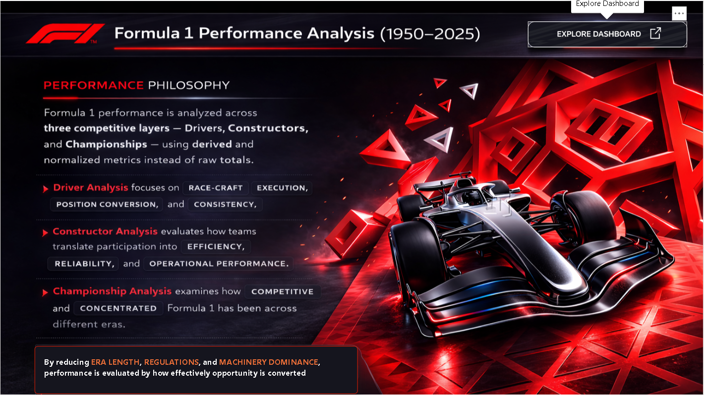
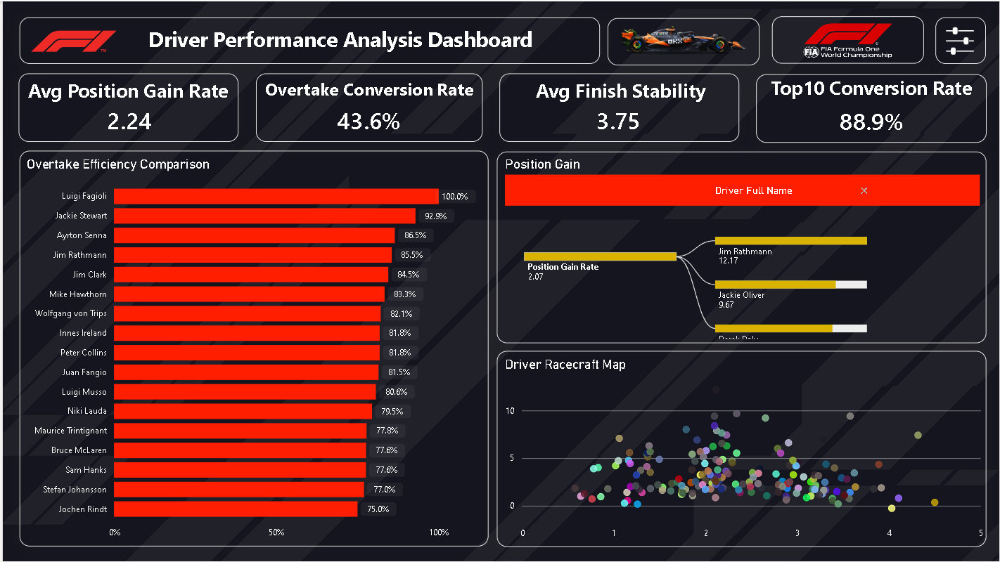
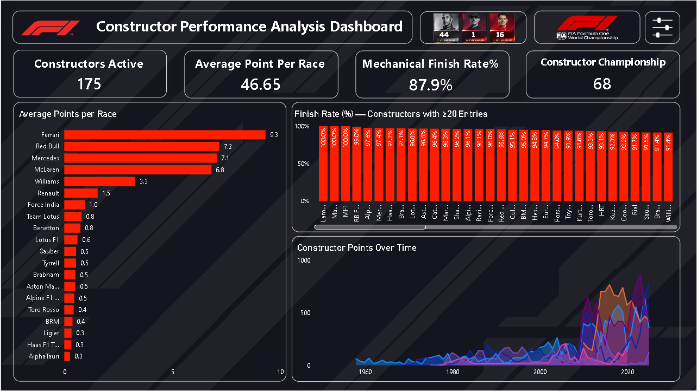
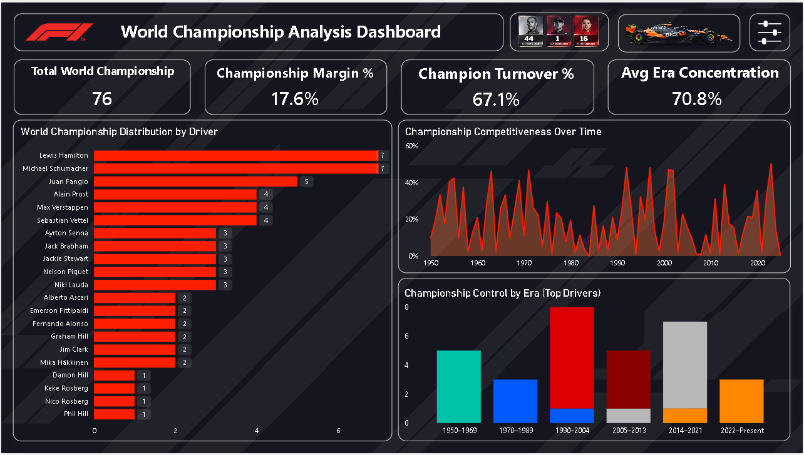
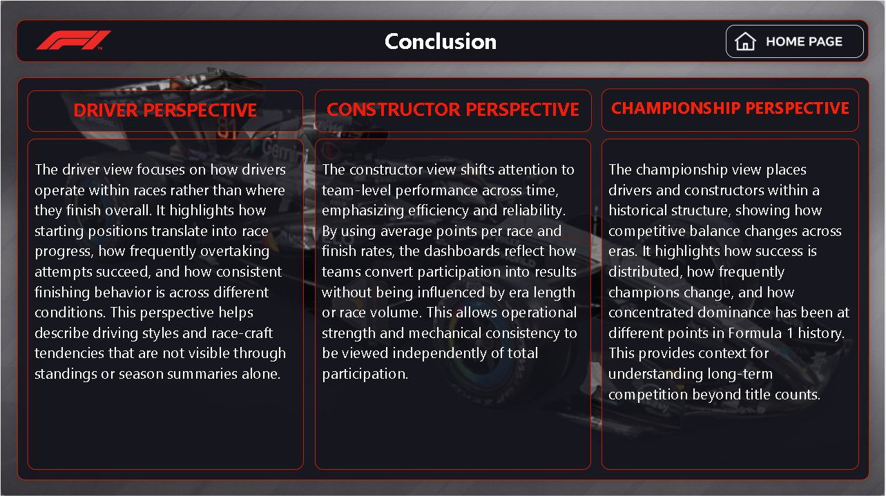

# 📊 Formula 1 Performance Analysis Dashboard

> Execution-based analysis of Formula 1 performance using Power BI (1950–2025)

---

## 🔍 Overview
This project analyzes historical Formula 1 data (1950–2025) to evaluate performance across drivers, constructors, and championships beyond traditional metrics such as wins and total points.

---

## 🎯 Objective
Traditional metrics like wins and points are influenced by factors such as car performance and era differences.  
This project focuses on evaluating how effectively performance is executed during races using normalized and comparative measures.

---

## 📊 Dashboard Structure

### 🏠 Home Page
- Provides an overview of the project and navigation across dashboards  
- Introduces the analytical approach and purpose  

---

### 🚗 Driver Performance
- Evaluates how drivers convert starting positions into race outcomes  
- Measures how effectively drivers overtake and maintain consistent finishing positions  

---

### 🏭 Constructor Performance
- Analyzes team performance using average points per race  
- Measures reliability through mechanical finish rate  

---

### 🏆 Championship Analysis
- Examines competitiveness across seasons  
- Analyzes dominance patterns and frequency of champion changes  

---

### 📌 Conclusion
- Summarizes key performance patterns across drivers, teams, and eras  

---

## ▶️ How to Use
- Use filters to select specific drivers, constructors, or seasons  
- Navigate across dashboards to compare performance at different levels  
- Analyze KPIs to understand efficiency, consistency, and competitiveness  

---

## ❓ Key Questions Answered
- Which drivers improve positions most effectively during races?  
- Which constructors balance efficiency and reliability?  
- How competitive has Formula 1 been across different eras?  

---

## 🛠 Tools Used
- Power BI  
- DAX  
- Excel  

---

## 📌 Key Insight
Performance in Formula 1 is better understood by how effectively opportunities are converted during races, rather than relying only on final outcomes such as wins or points.
